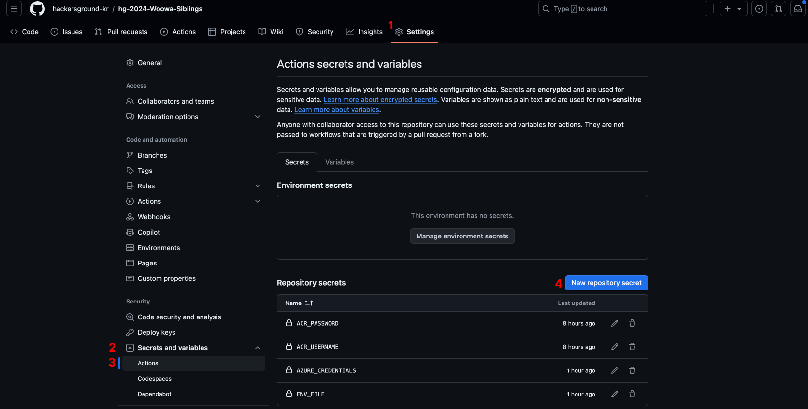

# SERVER_DEPLOY

### 서버 배포

1. Github 팀 Repository - Setting - Secrets and Variables - Actions 탭에서 New repository secret 버튼을 누른다.
2. Name 란에 ACR_NAME을 기입하고, Secret 란에 Container Registry의 이름을 기입하고 Add secret 버튼을 누른다.
3. Name 란에 RG_NAME을 기입하고, Secret 란에 본인의 리소스 그룹을 기입하고 Add secret 버튼을 누른다.
4. Name 란에 ENV_FILE을 기입하고, Secret 란에 넘겨받은 .env 파일의 내용을 붙여넣고 Add secret 버튼을 누른다.

[hg-2024-Woowa-Siblings](https://github.com/hackersground-kr/hg-2024-Woowa-Siblings) 레포지토리에는 canbus-server, canbus-web 두가지 모듈이 존재하는데,

canbus-server 모듈 안에 있는 파일이 변경된 commit을 main에 push 하게 되면 Github Actions workflow가 작동해서 서버 배포가 자동으로 진행된다.
(.gitignore 주석만 살짝 수정하는 식으로 테스트하시면 됩니다)