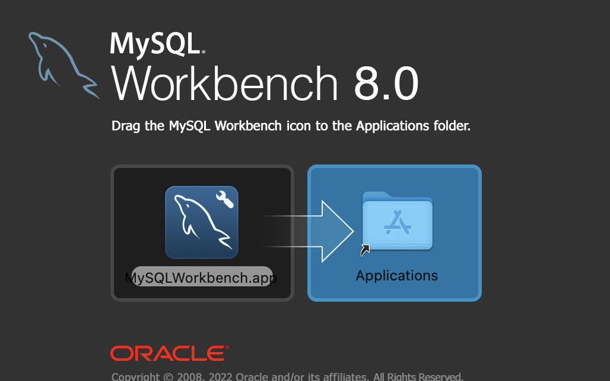

우선 터미널을 실행시켜 준다.

**설치하기**

1. 홈브루를 최신버전으로 업데이트 해 준다.

   

2. 홈브루를 통해 mysql을 설치한다.

   

3. 정상적으로 설치가 되었는지 확인해 준다.

   

**setting**

1. MySQL 서버를 가동시켜 준다.

   

2. 다음 명령어를 입력하면 여러 단계를 거쳐 설정을 할 수 있다.

   

*Q) Would you like to setup VALIDATE PASSWORD component?*

복잡한 비밀번호 설정 여부를 묻는 문장이다. 동의 여부 선택 후 비밀번호를 설정해 준다.

*Q)Remove anonymous user?*

사용자 설정 질문으로 Y를 입력했을 경우 접속 시 mysql -uroot 처럼 -u옵션이 필수이고, N일 경우 mysql 만으로 접속이 가능하다.

*Q)Disallow root login remotely?*

localhost를 제외한 다른 ip에서의 접속 허용 여부를 묻는 질문이다.

*Q)Remove test database and access to it?*

test 데이터베이스 제거 여부를 묻는 질문이다.

*Q)Reload privilege tables now?*

설정 내용을 테이블에 적용할 것인지에 대한 질문으로 무조건 Y를 입력하는것이 낫다.

1. 설정이 완료 되면 서버를 종료시켜 준다.

   

## 워크벤치 설치하기

https://downloads.mysql.com/archives/workbench/

우선 위 링크를 접속한다.

설치할 버전과 os를 확인하여 다운로드 한다.

   

드래그 앤 드롭으로 설치합니다
   

